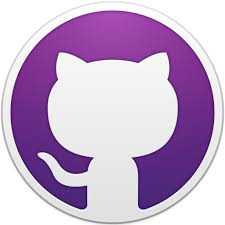

# Introduction to Git and GitHub
# Class 1: GitHub Desktop

## Objectives

Welcome to Introduction to Git and GitHub from fredhutch.io!
This course is designed for researchers who are interested in version control for code or data files,
and assumes no prior programming experience.
There are no prerequisites for this course
(though see below regarding the optional third class).

This course will introduce you to
the Git Desktop application to manage version control on your own computer and
GitHub to publish and collaborate with files tracked in remote repositories.
The optional third class applies skills from the first two classes using Git on the command line,
and requires some familiarity with navigating files and directories using the Unix commands.

To complete the activities associated with this course,
please ensure you have completed the following tasks (additional information can be found [here](http://www.fredhutch.io/software/#course-specific-software-requirements)):

- register for a GitHub account
- install GitHub Desktop (including the command line tools, if you are on a Windows computer and planning to complete the optional third session)
- (optional) install a text editor (like Atom or Notepad++)

By the end of this first session, you should be able to use the GitHub desktop app to:

- describe why and when to use version control
- apply the Git workflow to tracking changes using GitHub Desktop
- view and recall the history of tracked changes
- ignore files that don't need to be tracked


## What is version control?

Jorge Chan's [PhD Comics](http://phdcomics.com) illustrates why you might be interested in version control:


In fact,
you may already be familiar with the use of version control,
through:

- Microsoft Word's "track changes" option
- Google Docs version history
- Mac OSX Time Machine

Version control is used to record changes to all types of files,
but is especially important for code.
This is because changes made to code may have consequences for other parts of the file or project,
and being able to understand where changes caused problems is especially important.

In the simplest case,
version control allows you to identify what changes have occurred in a single file over time,
such as edits to a written document made by one person over time.
In more complex cases,
you may possess multiple copies of the same document,
with multiple individuals making changes at the same time,
some of which may be inconsistent with each other and need to be reconciled.
[Git](https://git-scm.com/about) is software that allows you to perform version control.
[GitHub](https://help.github.com/en/github) is website for publishing and sharing projects that are tracked using Git.
Git and GitHub are a very popular set of tools used by both academic and commercial organizations,
and correspondingly,
have well-developed help documentation and a large community of users to assist in their use.

This class will give you a basic introduction to the general Git workflow to track changes to files.
There are many additional resources available online through [GitHub](https://help.github.com/en/github) to help you along the way.

## Getting set up

We'll get started by checking to make sure GitHub Desktop has installed appropriately
and has relevant settings correctly assigned.

First, open GitHub Desktop.
If you are on a Windows machine and have also installed Git for Windows,
please make sure you're opening the correct application.
The icon for GitHub Desktop show the silhouette of the GitHub mascot,
Octocat (octopus cat):



Next,
go to the toolbar at the top and select "GitHub Desktop"
and then "Preferences."
You should now be able to see the Preferences pop-up window.
Let's check the settings in the following tabs:

- "Accounts":
you should see your GitHub handle
(begins with `@`)
and name below "GitHub.com".
If not, please sign in using your account information.
- "Integrations": this is where you can select a default text editor for opening files.
It is not essential to have this set,
but may be convenient.
The [installation instructions](http://www.fredhutch.io/software/#course-specific-software-requirements) recommended Atom.
In general,
the default text editors on your computers
(Notepad, TextEdit) will not work well for writing code.
If you don't see any text editors available here,
that's ok!
You won't be able to use the shortcut to access files from GitHub Desktop,
but you'll still be able to complete the class activities.
- "Appearance": select the Dark theme if you prefer.

There are other options available under "Advanced",
you can consider changing these once you have more familiarity with version control
and your particular needs.

## Creating a repository

If you have taken Intro to R or Intro to Python through fredhutch.io,
you should be familiar with projects as a way to organize your work.
A project is a single folder containing the files associated with a unit work work,
like a chapter of a thesis/dissertation,
analysis for a manuscript, or a monthly report.

> "Folder" and "directory" will be used interchangeable for the purposes of this lesson.
> Similarly, "project" and "repository" are generally analogous for our purposes.

Git tracks changes associated with repositories.
A repository is a project folder containing all the files,
including code and data, associated with a particular unit of work,
as well as the history of changes associated with those files.

> If you'd like another explanation of creating a repository,
> [these instructions](https://help.github.com/en/desktop/getting-started-with-github-desktop/creating-your-first-repository-using-github-desktop)
> from GitHub will walk you through the process using the
> "Create a tutorial repository and clone it" option in GitHub Desktop.

We'll get started with our first repository by clicking the button for
"Create a New Repository on your Hard Drive."
You can also access this feature under "File" -> "New repository".
Enter the following options:

- Name: `first_repository`
- Description: "first repository for training".
The description should be a brief (>10 word) statement describing the purpose of the project
- Local path: location on your computer where the repository will be saved.
We recommend saving your repository to your Desktop so it's easy to find,
and will assume for the rest of this lesson that your repository is available there.
- Check the box to "initialize this repository with a README"
- Click "Create repository" to finish

> It's good practice to avoid spaces in your file and directory names.
> We'll continue to apply best practices and convention for organizing files and directories for this class;
> if you're interested in the rationale,
> please see fredhutch.io's class Data for Data Science.

We can explore what happens following creation of a repository,
sometimes called "initializing,"
by looking on your Desktop and locating the directory named `first_repository`.

The only file we can see contained in this directory is `README.md`,
a plain text file we can open in a text editor.
The file suffix `md` stands for Markdown,
which is a method of formatting text.
README is a standard name for a descriptive file contained in a repository,
and documents the contents of the directory.
In our case,
the README is pre-populated with the title of the repository
and short description we entered when creating it.

`README.md` is the only file we can currently see,
but there is other information contained in our repository.
This other information is currently hidden,
but we can access it by using a keyboard shortcut: `CMD + Shift + .`.
There are two additional things now visible:
- `.gitattributes`: this text file is created by GitHub Desktop to help ensure appropriate settings (e.g., line endings for text files, which can differ among operating systems).
- `.git/`: directory containing the history of changes tracked by Git

The `.git/` directory is how Git recognizes your project represents a repository,
and assumes you want to track all of the files contained within it.
Git tracking is recursive,
meaning not only the files in your project,
but all the files contained in folders in that directory can be tracked as well.

**Challenge:** What would happen if you tried to create a new Git repository
inside another Git repository?

## Tracking changes

Now that we have created a Git repository,
we're ready to start learning about using Git to track files.

Although Git can track files of any type,
we'll be working with text files in this course,
as these files are relatively simple and will allow us to easily control and view the changes we make.

> If you're accustomed to view text in word processing software like Microsoft Word,
> it can be an adjustment to viewing text in a text editor instead.
> The reason we don't use word processing software to write code
> is because files produced by these programs include lots of other information
> that controls the formatting and appearance of the documents,
> which make it difficult (or even impossible) for computers to understand the contents.
> [This blog post](https://www.techstuffed.com/what-are-text-editors-and-why-are-they-important/)
> does a good job explaining this in more detail.

Open your `README.md` file from your repository in your text editor (e.g., Atom).
Add a longer description for the repository to this file:

```
Created for Intro to Git and GitHub from fredhutch.io
```

Make sure you save the changes,
then go back to GitHub Desktop.
What differences do you notice?

The "Changes" tab in left panel shows what files have been altered.
These represent files that have been saved on the computer,
but are not yet tracked by Git.
The panel on the right shows what changes have occurred,
and are documented by lines of code
(in our case, this corresponds to text):
green indicates content that has been added,
red indicate content that has been removed.
A check mark next to a file indicates what is slated to be added to repository,
which means it will be tracked by Git.
If you uncheck the file,
you won't be able to make a commit,
as Git doesn't recognize any changes.

In order for Git to track the file,
we need to create a commit.
You can accomplish this task in the lower left hand panel of GitHub Desktop.
Above the blue "Commit to master" button,
there are two boxes for text entry.
The smaller box on top is for the main commit summary,
which should be brief (<50 characters).
Use the second box to enter longer descriptions,
which may be useful for more complex sets of changes.
After you've entered a meaninginful message,
click the button to "Commit to master", where "master" refers to the default branch (we'll talk more about branches later).

This represents the basic Git workflow:

- save changes to a file (for example, in a text editor)
- stage the file to ensure it will be added to the repository (checking the box in GitHub Desktop)
- commit the change (click the "Commit to master" button)

This may seem like a complex process,
but it helps to think about it like shopping at a grocery store.
Saving changes to a file is like deciding to select something from the grocery shelf.
Staging the changes to add to your repository is like placing the item in your cart.
Commmitting those changes is like completing the purchase of all items in your cart.
The items don't really belong to you until the last step of the process.

Let's add another line to our `README.md` file:

```
Example repository used for demonstration purposes
```

Don't forget to save and commit this change!

> Git tracks entire lines of code.
> This means that changes made to a previously existing line will appear
> as a deletion of the original line,
> and addition of the new line.

Next, let's create a new file named `notes.txt` in our text editor.
Add a line of text:

```
Notes about my analysis
```

Document the presence of this file in `README.md` by adding the following line:

```
notes.txt holds notes about the analysis
```

Commit the changes to both of these files.

#### Challenge-flow

- Create a new file in your project directory named `analysis.txt`.
Add a line of content to the file and commit it to your repository.
- Make changes to both `analysis.txt` and `notes.txt`,
then commit both changes at once.
- You would like to create a new folder called `data/`,
which will hold two new data files (`data1.txt` and `data2.txt`).
What happens when you try to commit an empty folder?


## Exploring history

* "Undo" button at bottom of changes tab, can undo one at a time
* history tab in left panel
	* shows every time you've committed changes (remember, this is different than each time you hit save on a file)
	* right click
	* "Revert commit" to go directly back to that point in history: this retains all changes, but undoes the tracking in Git
* SHA: Secure Hash Algorithm
	* string of alphanumeric characters, unique label for the commit
	* can be just the first seven characters
* "Discard changes" allows you to reset to where you were previously


## Ignoring things

* create new file, temp.txt, save and commit
* Repository -> Repository settings
* select tab for "Ignored Files"
* add temp.txt to this file; what happens?
* add notes.txt to the ignore file; what happens?
	* this is an example of a specific task which may be better accomplished with command line functions
	* preview concerns with managing large data files or secure info
* can ignore entire directories, or use wildcards to indicate types of files


## Branches

* branch: a parallel version of the “master” repository that allows you to test changes without affecting the original (or live) version; changes in a branch can be merged back to the “master” when a particular task has been completed
* why use branches?
	* when working collaboratively, someone else may want to try something but you need to keep working without seeing their changes
	* you may want to try something that has a chance of not working, and you don't want to risk having to undo a bunch of stuff
* create new branch called "wacky-branch"
* add some data files, commit
* show original branch and note files aren't there (also show on Desktop!)
* merge branches and show history
* deleting old branch: when on branch, menu option (note that branch is completely gone forever!)


## Wrapping up

This class introduced you to version control using Git Desktop.
We covered the general Git workflow,
its implementation using GitHub Desktop,
working with the tracked history,
and ignoring files that don't need to be tracked.
For more information on using GitHub Desktop,
the [GitHub help documentation](https://help.github.com/en/desktop) includes lots of great explanations and illustrations for a variety of uses.

In the next class,
we'll learn about publishing repositories and collaborating using remote repositories in GitHub.
